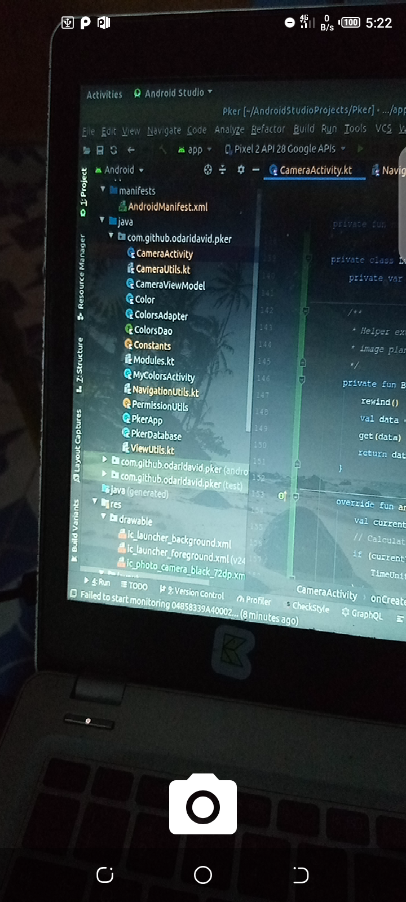

# Pker
🎨Pick colors with Camerax and get more detail such as RGB &amp; HEX code values and Color Name

## Libraries Used

- [Android Jetpack](https://developer.android.com/jetpack)🚀
- [kotlinx.coroutines](https://github.com/Kotlin/kotlinx.coroutines) - Library Support for coroutines,provides `runBlocking` coroutine builder used in tests
- [Material Design](https://material.io/develop/android/docs/getting-started/) - build awesome beautiful UIs.🔥🔥
- [Koin](https://github.com/InsertKoinIO/koin) - lightweight dependency injection framework
- [Coil](https://github.com/coil-kt/coil) - Image loading
- [Timber](https://github.com/JakeWharton/timber) - Logger
- [Recyclerview Animators](https://github.com/wasabeef/recyclerview-animators) - Simplifies recyclerview animations

## Screenshots

||
|:--:|

## Contributions

All Contributions are welcome.

## License

```
  Copyright 2020 David Odari
 
  Licensed under the Apache License, Version 2.0 (the "License"); you may not use this file except
  in compliance with the License. You may obtain a copy of the License at
           http://www.apache.org/licenses/LICENSE-2.0
  Unless required by applicable law or agreed to in writing, software distributed under the License
  is distributed on an "AS IS" BASIS, WITHOUT WARRANTIES OR CONDITIONS OF ANY KIND, either express
  or implied. See the License for the specific language governing permissions and limitations under
  the License.

 ```
 
